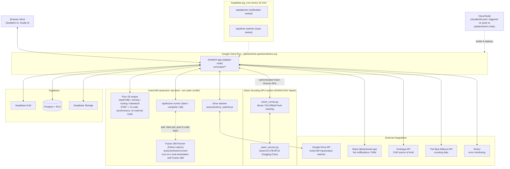

# Architecture

A whole-app visual overview: how the pieces connect, not what each one does
in detail - see [README.md](README.md)'s own **Stack**, **AutoCAM**,
**Module map**, **Data layer**, and **Deployment & CI** sections for that.
This file is a **living reference**, same rule as README's: update the
diagram whenever a subsystem, external integration, or deployment target is
added, removed, or changes shape - a stale picture is worse than none.

## Whole-system diagram

## Reading this diagram

- **One web app, two very different CAM execution paths.** Turning/
  routing/tube-stock G-code is generated synchronously, in-process, by pure
  JS - no queue, no external process. Fusion-backed plate/box-tube CAM is
  asynchronous: the app only ever writes a job row and an immutable
  snapshot; a **physically separate Fusion 360 installation**, running the
  Python Runner add-in, polls `/api/fusion-runner` to claim work, drives
  Fusion's own CAM engine, and posts G-code back. The web app never runs
  Fusion itself.
- **Vision Scouting's GPU work is also physically separate** - it runs on
  team-owned NVIDIA DGX Spark hardware (`vision/runner/docker-compose.yml`),
  not on Cloud Run, and reaches the app only through its own authenticated
  runner API surface.
- **Supabase is the only real authorization boundary** - RLS policies on
  Postgres, not app-layer checks (see README's **Known gaps**).
- **Two deploy targets exist today** (Cloud Run primary, Vercel being
  phased out) - this diagram shows Cloud Run only, since that's the one
  Cloud Build actually deploys via the `spartanshub` remote's own trigger.

## Stack at a glance

| Layer | Choice |
|---|---|
| Frontend framework | SvelteKit (Svelte 5), plain JS, no TypeScript |
| Hosting | Google Cloud Run (`adapter-node`), via Cloud Build + Docker |
| Database / Auth / Storage | Supabase (Postgres + RLS, Supabase Auth, Supabase Storage) |
| 3D / CAD | `occt-import-js` (STEP parsing, WASM) + `three.js` |
| CAM (non-Fusion) | Pure JS, no external CAM software, no DXF |
| CAM (Fusion) | Python add-in inside a real Fusion 360 install, job-queue driven |
| Vision inference | Qwen3.8-27B BF16 on NVIDIA DGX Spark, separate from web deploy |
| Messaging | Slack (`@slack/web-api`) |
| External CAD/data sources | Onshape API, The Blue Alliance API |
| Monitoring | Sentry |

See README's own **Stack** section for the full prose version of this
table, and **AutoCAM** / **Module map** for where each subsystem's code
actually lives.
